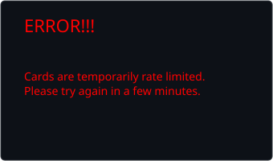
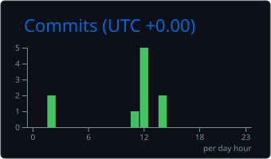
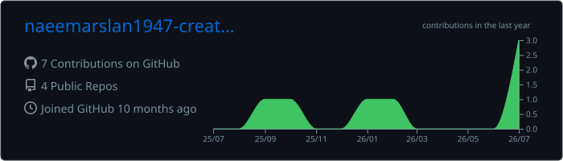

 

  

### Building production UIs — and collaborating on large-scale product systems

 

  
  &nbsp;
  
  &nbsp;
  

---

## Collaborations — production projects

Actively contributing to large product frontends (admin portals, seller platforms, healthcare & sports systems):

| Project | Focus |
|:---|:---|
| **[SafarCapital Seller Portal](https://github.com/dayyanshahid/SafarCapital-SellerPortal-Frontend)** | Seller-facing fintech / capital platform UI |
| **[SafarCapital Admin Portal](https://github.com/dayyanshahid/SafarCapita-AdminPortal)** | Admin operations & control panel |
| **[Synaptix Care Frontend](https://github.com/dayyanshahid/Synaptix-Care-Frontend-V3-V0)** | Healthcare product UI (V3) |
| **[Synaptix Admin Frontend](https://github.com/dayyanshahid/Synaptix-Admin-Frontend)** | Synaptix administration experience |
| **[Synaptix AI Texting](https://github.com/dayyanshahid/Synaptix-Ai-Texting-Frontend)** | AI-assisted messaging frontend |
| **[Cricket Admin Panel](https://github.com/dayyanshahid/Cricket-Admin-Panel)** | Sports admin dashboard |
| **[Crickitt Backend](https://github.com/the-platapus/Crickitt-backend-fork)** | Backend services collaboration |

---

## Personal projects

| Project | Stack | What it explores |
|:---|:---|:---|
| **[ran-voice](https://github.com/naeemarslan1947-creator/ran-voice)** | TypeScript · Next.js | Voice-first / interactive web experiences |
| **[backend-repo](https://github.com/naeemarslan1947-creator/backend-repo)** | PHP | Server-side architecture & API foundations |
| **[my-valentine](https://github.com/naeemarslan1947-creator/my-valentine)** | TypeScript | Creative web interactions & playful UX |

---

## Toolkit

---

## Pulse

<!-- Cards are stored in ./cards (auto-refreshed by Actions) so GitHub always displays them -->

&nbsp;&nbsp;

&nbsp;&nbsp;

  

&nbsp;&nbsp;

  

  

---

Collaborating on products that ship · Building systems that last

