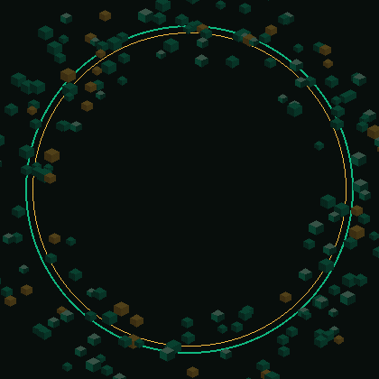

<div align="center">


<br/>

<!-- 3D voxel monogram — assemble → hold → scatter (emerald / gold, distinct from photo particles) -->


<br/><br/>

### Shipping ideas across frontend, backend & voice experiences


<br/>

<p>
  <a href="https://github.com/naeemarslan1947-creator"></a>
  &nbsp;
  <a href="https://linkedin.com/in/YOUR-LINK"></a>
  &nbsp;
  <a href="mailto:your@email.com"></a>
</p>


</div>

---

## About this workspace

I build across the stack — from polished TypeScript UIs to PHP services and experimental voice interfaces. This profile tracks active experiments, shipped side projects, and the systems behind them.

```bash
$ whoami
naeemarslan1947-creator

$ focus
→ Product-minded engineering
→ Clean APIs + reliable backends
→ Interfaces people actually enjoy using
```

---

## Featured work

| Project | Stack | What it explores |
|:---|:---|:---|
| **[ran-voice](https://github.com/naeemarslan1947-creator/ran-voice)** | TypeScript · Next.js | Voice-first / interactive web experiences |
| **[backend-repo](https://github.com/naeemarslan1947-creator/backend-repo)** | PHP | Server-side architecture & API foundations |
| **[my-valentine](https://github.com/naeemarslan1947-creator/my-valentine)** | TypeScript | Creative web interactions & playful UX |

---

## Toolkit

<div align="center">

<p>
  
</p>

</div>

| Layer | Tools I reach for |
|:---|:---|
| **Interface** | React, Next.js, TypeScript, modern CSS |
| **Server** | PHP, Node.js, REST-oriented APIs |
| **Craft** | Git workflows, iterative UX, readable architecture |

---

## Operating principles

```diff
+ Ship small, learn fast
+ Prefer clarity over cleverness
+ Treat performance as a feature
+ Design for the person on the other side of the screen
- Don't leave half-finished systems in production
```

---

## Pulse

<div align="center">


&nbsp;


<br/><br/>


<br/><br/>


</div>

---

<div align="center">


<sub>Emerald builds · Gold details · Always iterating</sub>

</div>
